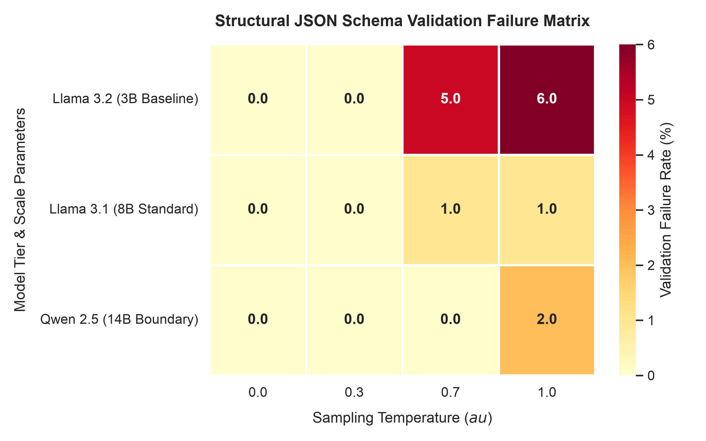
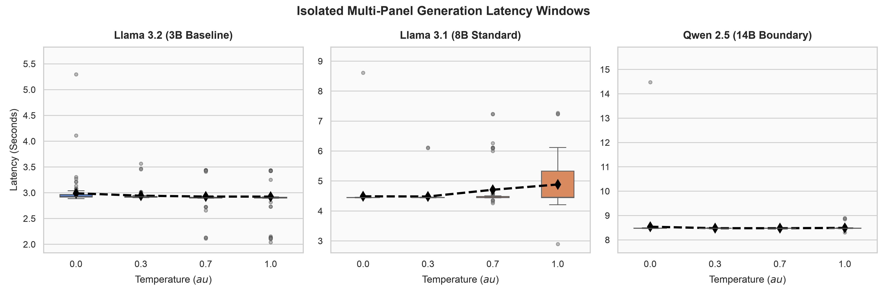
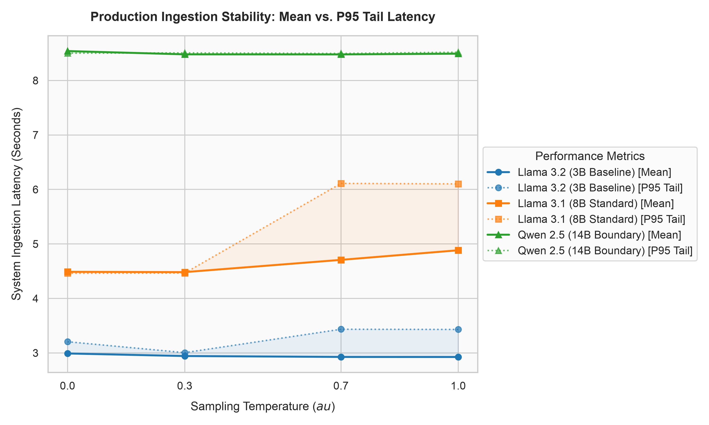

# Quantization Precision Degradation and Latency Predictability in Deterministic Local LLM Ingestion Pipelines

This repository contains the source code, raw datasets, analysis pipelines, and the complete research paper investigating **Syntax Rot** and system latency performance of quantized Large Language Models (LLMs) deployed locally for structured data ingestion.

📄 **Read the Full Paper:** [local-llm-structured-output-reliability.pdf](local-llm-structured-output-reliability.pdf)

---

## 📊 Overview & Key Findings

In modern distributed architectures, utilizing generative local LLMs to produce structured outputs (such as JSON arrays) for backend database ingestion introduces structural reliability risks. Post-training quantization (PTQ) downscales parameter precision to fit edge hardware constraints but introduces mathematical rounding noise. 

This project benchmarks three localized model scales under different sampling temperatures ($\tau \in \{0.0, 0.3, 0.7, 1.0\}$) across **1,200 continuous requests** on an Apple M4 Silicon System-on-Chip (SoC) platform.

### Key Results
1. **The Syntax Rot Inflection Point:** Under low-entropy conditions ($\tau \le 0.3$), all model sizes achieved **100% schema compliance** (0.0% failure rate). Under higher sampling temperatures ($\tau \ge 0.7$), the Llama 3.2 (3B) baseline model experienced structural syntax degradation, registering failure rates up to **6.0%**. In contrast, the Llama 3.1 (8B) and Qwen 2.5 (14B) models remained highly resilient (at or below 1% and 2% failure rates respectively).
2. **The Latency Premium:** Moving from the 3B baseline ($\mu = 2.94$\,s) to the 14B boundary model ($\mu = 8.49$\,s) incurs a **3x latency premium**.
3. **SLA Jitter and Hardware Stability:** The Service Level Agreement (SLA) tail latency ($P_{95}$) remained exceptionally flat and stable relative to the Mean across the entire run. This confirms that local unified memory SoC platforms do not suffer from thermal throttling or memory leak degradation during sustained compute tasks.

### 📈 Experimental Visualizations

#### Structural Schema Validation Failure Matrix (Heatmap)


#### Processing Latency Distributions (Boxplots)


#### Production Ingestion Stability: Mean vs. P95 Tail Latency (SLA Chart)


---

## 📁 Repository Structure

* [local-llm-structured-output-reliability.pdf](local-llm-structured-output-reliability.pdf): The compiled academic research paper.
* [main.tex](main.tex): LaTeX source code for the research paper.
* [benchmark.py](benchmark.py): Automated test harness executing the 1,200 query matrix using local Ollama endpoints and validating outputs via Pydantic schemas.
* [analyze_results.py](analyze_results.py): Data science pipeline using Pandas, NumPy, Seaborn, and Matplotlib to compile statistical results and generate paper figures.
* [sanity_check.py](sanity_check.py): Connection and environment verification script for the local Ollama daemon.
* [syntax_rot_multi_temp_results.csv](syntax_rot_multi_temp_results.csv): Complete raw experimental dataset containing metrics for every inference loop.
* [academic_summary_table.md](academic_summary_table.md): Markdown-formatted tabular summary of the validation runs.
* **Visualizations:**
  * [reliability_matrix_heatmap.png](reliability_matrix_heatmap.png): Structural validation failure rate matrix heatmap.
  * [faceted_latency_distributions.png](faceted_latency_distributions.png): Boxplot showing true processing latency distributions.
  * [production_sla_tail_latency.png](production_sla_tail_latency.png): Performance line chart showing Mean vs. $P_{95}$ tail latency bounds.

---

## 🛠️ Replication & Setup Guidelines

### 1. Prerequisites & Local Model Server
Ensure that [Ollama](https://ollama.com/) is installed and running locally on your machine.

Pull the exact model configurations used in the evaluation:
```bash
ollama pull llama3.2
ollama pull llama3.1:8b
ollama pull qwen2.5:14b
```

### 2. Python Environment Setup
Create a virtual environment and install the required dependencies:
```bash
python3 -m venv venv
source venv/bin/activate
pip install pandas numpy matplotlib seaborn pydantic ollama
```

### 3. Run Sanity Connection Check
Ensure your Python environment can successfully communicate with the Ollama server:
```bash
python sanity_check.py
```

### 4. Execute the Benchmark
Run the full 1,200 request test loop (this will generate the CSV dataset):
```bash
python benchmark.py
```

### 5. Generate Figures and Analyses
Compile the raw results into the academic table and visual figures:
```bash
python analyze_results.py
```

---

## 📋 Summary Performance Matrix

| Model | Temp ($\tau$) | Total Loops | Passes | Failures | Failure Rate (%) | Avg Latency (s) |
| :--- | :---: | :---: | :---: | :---: | :---: | :---: |
| **Llama 3.2 (3B Baseline)** | 0.0 | 100 | 100 | 0 | 0.0% | 2.99s |
| | 0.3 | 100 | 100 | 0 | 0.0% | 2.94s |
| | 0.7 | 100 | 95 | 5 | 5.0% | 2.93s |
| | 1.0 | 100 | 94 | 6 | 6.0% | 2.93s |
| **Llama 3.1 (8B Standard)** | 0.0 | 100 | 100 | 0 | 0.0% | 4.49s |
| | 0.3 | 100 | 100 | 0 | 0.0% | 4.48s |
| | 0.7 | 100 | 99 | 1 | 1.0% | 4.71s |
| | 1.0 | 100 | 99 | 1 | 1.0% | 4.88s |
| **Qwen 2.5 (14B Boundary)** | 0.0 | 100 | 100 | 0 | 0.0% | 8.54s |
| | 0.3 | 100 | 100 | 0 | 0.0% | 8.48s |
| | 0.7 | 100 | 100 | 0 | 0.0% | 8.48s |
| | 1.0 | 100 | 98 | 2 | 2.0% | 8.49s |

---

## ✍️ Authors & Citation
* **Yashrith Chittoor Hari Krishna**

If you use this benchmark, code, or findings in your academic or systems work, please cite the paper:
```bibtex
@article{krishna2026quantization,
  title={Quantization Precision Degradation and Latency Predictability in Deterministic Local LLM Ingestion Pipelines},
  author={Yashrith Chittoor},
  journal={IEEE Transactions on Mobile Computing & Edge Intelligence},
  volume={14},
  number={2},
  year={2026}
}
```
